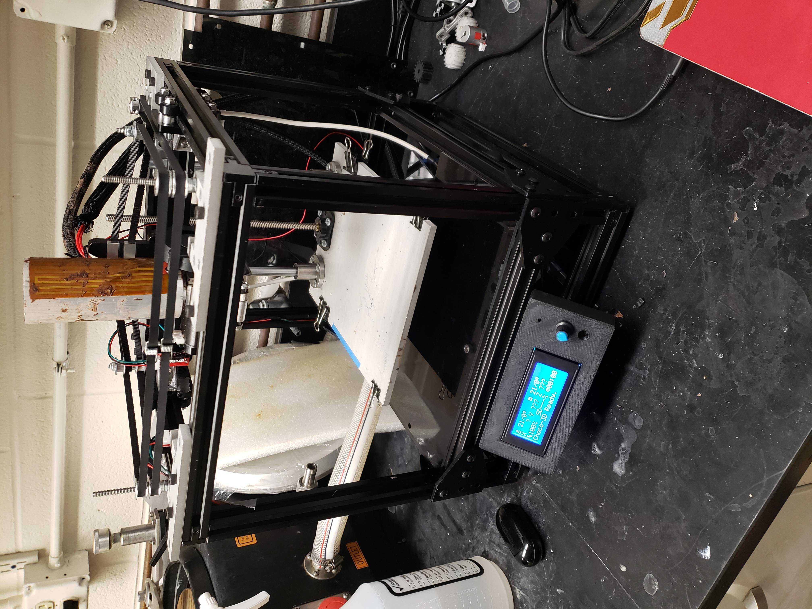
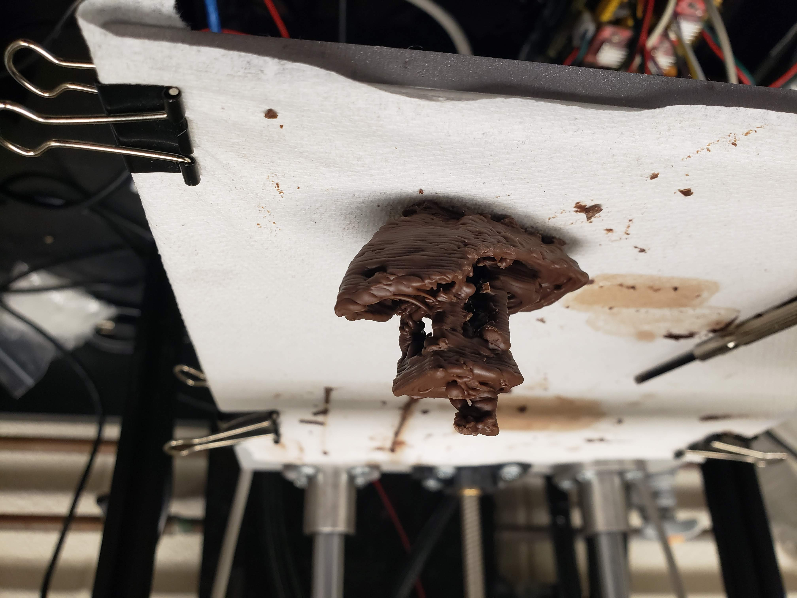

# Chocolate-3D-Printer

3D printer that prints edible chocolate!
 

This 3D printer is capable of printing 3D objects from standard 3D printer .gcode files, such as the 3D Benchy demonstration print shown below.

The Chocolate 3D Printer was designed in 2 iterations: the first as a group project during fall 2021 senior design and the second as an independent design project I worked on spring 2022.

For detailed information, the final report on this project is available under "Independent Design Project Final Report.pdf"

This project was created as a Mechanical Engineering Senior Design Project at the University of Notre Dame. Credit to Kassidy, Max, Morgan, and Thomas who were my teammates. The Chocolate 3D Printer is still equally yours as it is mine.

(printer in operation)

